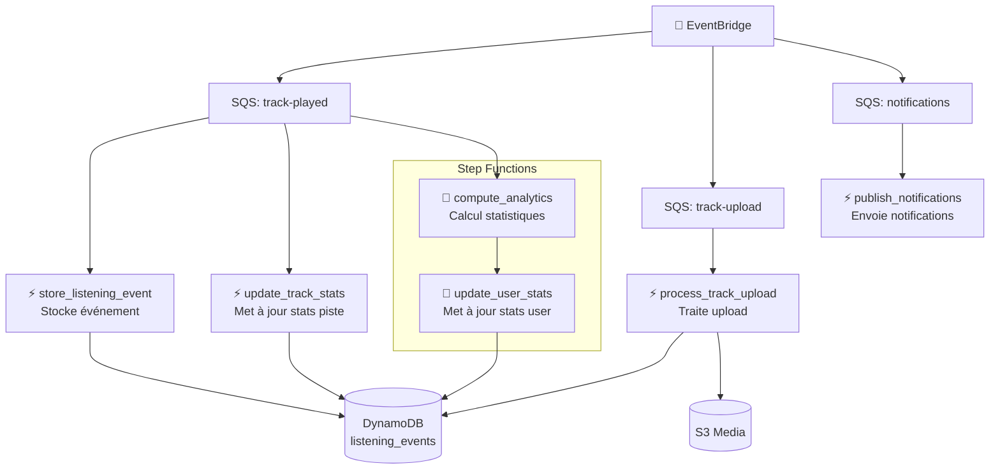

# Spotify App

Plateforme de streaming audio serverless construite sur AWS, conçue pour séparer strictement les parcours temps réel orientés utilisateur des traitements asynchrones de données, d'indexation et d'analytics.

Le projet combine un frontend React/Vite, une couche d'API exposée via API Gateway, des traitements métier implémentés en AWS Lambda, un socle d'événements autour d'EventBridge et SQS, une orchestration Step Functions et une infrastructure déclarative en Terraform.

## Résumé Exécutif

L'objectif du projet est de fournir une architecture de type plateforme de streaming moderne avec les propriétés suivantes :

- diffusion directe des médias via CloudFront et S3, sans faire transiter l'audio par l'API applicative
- découplage des traitements métier via des événements pour absorber la charge et éviter les dépendances synchrones inutiles
- séparation claire entre lecture du catalogue, ingestion média, capture des écoutes et calcul des statistiques
- déploiement et gouvernance de l'infrastructure via Terraform

Le système est organisé autour de quatre plans complémentaires :

- plan de présentation : SPA React distribuée via S3 et CloudFront
- plan de contrôle : API Gateway et Lambdas API pour les opérations synchrones
- plan événementiel : EventBridge, SQS et Lambdas événements
- plan analytique et d'orchestration : Step Functions, Lambdas d'orchestration, DynamoDB Streams et OpenSearch

## Capacités Métier

Le périmètre actuellement représenté dans le dépôt couvre principalement les capacités suivantes :

- authentification et autorisation via Amazon Cognito
- consultation du catalogue audio
- récupération du profil utilisateur et de l'historique d'écoute
- création d'un titre côté administration avec réservation d'upload sur S3
- validation d'un upload MP3 et passage du titre à l'état `READY`
- émission d'un événement métier `TrackPlayed` lors d'une lecture
- stockage des événements d'écoute et mise à jour des statistiques piste, utilisateur et globales
- indexation et recherche de titres via OpenSearch

Certaines capacités existent dans le dépôt sous forme de stubs ou de placeholders et ne doivent pas être présentées comme finalisées tant qu'elles n'ont pas été implémentées de bout en bout.

## Principes d'Architecture

### 1. Séparation stricte des flux

Le média audio n'est pas servi par l'API métier. L'API délivre des métadonnées, des URLs et des événements ; le contenu audio est distribué par CloudFront depuis S3. Cette séparation réduit les coûts, améliore la latence et évite de coupler la scalabilité du streaming à celle des traitements applicatifs.

### 2. Event-driven par défaut

Les événements métiers sont publiés sur EventBridge afin de déclencher plusieurs traitements indépendants : audit, agrégations, enrichissements et indexation. Cette approche réduit le couplage temporel entre producteurs et consommateurs.

### 3. Serverless natif

Le projet privilégie les services managés AWS : API Gateway, Lambda, DynamoDB, EventBridge, SQS, Step Functions, CloudFront, S3 et OpenSearch. L'architecture vise la résilience opérationnelle, le scaling horizontal automatique et la réduction du coût d'exploitation.

### 4. Infrastructure as Code

L'infrastructure est déclarée sous `infra/` avec un découpage modulaire Terraform. Les environnements sont organisés sous `infra/env/` et les briques réutilisables sous `infra/modules/`.

## Vue d'Architecture

### Chaîne de valeur technique

1. Le frontend React interagit avec API Gateway pour les parcours synchrones.
2. Les Lambdas API lisent ou écrivent les métadonnées dans DynamoDB.
3. Les événements métier sont publiés sur EventBridge.
4. Les traitements asynchrones consomment les événements via SQS ou Step Functions.
5. Les médias sont stockés sur S3 et servis par CloudFront.
6. Les titres prêts à être recherchés sont indexés dans OpenSearch.

### Composants principaux

- frontend web : [app/spotify_ui_frontend](app/spotify_ui_frontend)
- lambdas applicatives : [app/lambdas](app/lambdas)
- infrastructure Terraform : [infra](infra)
- documentation projet : [doc](doc)

## Architecture Applicative

### Frontend

Le frontend est une SPA React 18 construite avec Vite et Tailwind CSS. Il gère :

- l'authentification Cognito Hosted UI avec PKCE
- les parcours catalogue et recherche
- la lecture de titres côté client
- l'upload d'un titre côté administration

Le code est situé dans [app/spotify_ui_frontend](app/spotify_ui_frontend).

### Couche API

Les endpoints REST sont exposés par API Gateway et routent vers des Lambdas Python. Les principales routes actuellement déclarées dans l'environnement `dev` sont :

- `GET /health`
- `GET /search`
- `GET /analytics/global`
- `GET /tracks`
- `GET /tracks/{trackId}`
- `GET /tracks/{trackId}/stats`
- `POST /tracks`
- `POST /tracks/{trackId}/play`
- `GET /me`
- `GET /me/recently-played`
- `GET /me/listening/history`

La définition API Gateway se trouve dans [infra/env/dev/apigw.tf](infra/env/dev/apigw.tf).

### Couche Événements

Le plan événementiel traite les événements métier et techniques selon plusieurs patterns :

- EventBridge pour le bus métier
- SQS pour l'absorption et le découplage des consommateurs
- Lambda pour les traitements ciblés
- Step Functions pour les agrégations multi-étapes

### Couche Data

Le projet s'appuie principalement sur :

- DynamoDB pour les métadonnées métier, les événements d'écoute et les agrégats
- S3 pour les médias audio et assets associés
- OpenSearch pour la recherche texte et l'indexation du catalogue

## Lambdas par Domaine

### Lambdas API

Les Lambdas API gèrent les interactions synchrones avec le frontend :

- `api_create_track` : réserve un titre, contrôle l'unicité du hash audio et génère les URLs d'upload S3
- `api_get_tracks` : liste les titres publiables du catalogue
- `api_get_track` : retourne le détail d'un titre prêt à être lu
- `api_get_track_stats` : expose les statistiques d'une piste
- `api_get_me` : retourne l'identité issue du token Cognito
- `api_get_me_recently_played` : retourne les pistes récemment jouées
- `api_get_myhistory` : retourne l'historique d'écoute enrichi
- `api_get_user` : retourne l'agrégat utilisateur
- `api_get_analytics` : retourne les statistiques globales du jour
- `api_start_stream` : publie l'événement métier `TrackPlayed`
- `api_search` : interroge OpenSearch
- `api_healthcheck` : point de santé technique

### Lambdas événements

- `event_store_listening_event` : persiste les événements d'écoute bruts
- `event_update_track_stats` : met à jour les agrégats piste côté événementiel
- `event_process_track_upload` : valide l'upload MP3, calcule le hash réel et passe un titre à `READY`
- `event_publish_notifications` : présent dans le dépôt mais encore placeholder

### Lambdas d'orchestration

La state machine définie dans [infra/env/dev/step_functions.tf](infra/env/dev/step_functions.tf) orchestre trois traitements :

- `orch_update_track_stats`
- `orch_update_user_stats`
- `orch_compute_analytics`

Cette chaîne produit les agrégats piste, utilisateur et globaux à partir d'un même flux métier.

### Lambdas techniques

- `tech_reindex_opensearch` : consomme le stream DynamoDB de la table tracks et synchronise OpenSearch
- `tech_show_index_opensearch` : utilitaire d'inspection d'index
- `tech_ingest_audio_metadata` : présent dans le dépôt mais encore placeholder

## Flux Métier de Référence

### Lecture d'un titre

1. Le frontend appelle `POST /tracks/{trackId}/play`.
2. `api_start_stream` vérifie que la piste existe et que son statut est `READY`.
3. La Lambda publie l'événement `TrackPlayed` sur EventBridge avec un `correlationId`.
4. Les consommateurs asynchrones stockent l'événement brut et mettent à jour les agrégats.
5. Step Functions exécute la chaîne d'analytics et de statistiques utilisateur.

### Création et validation d'un titre

1. Un administrateur appelle `POST /tracks`.
2. `api_create_track` crée les métadonnées initiales et réserve l'upload.
3. Le client envoie le MP3 et la cover directement sur S3 via URLs pré-signées.
4. L'événement S3 déclenche `event_process_track_upload`.
5. La Lambda valide le contenu, calcule le hash, extrait la durée et passe le titre à `READY`.
6. Le stream DynamoDB déclenche `tech_reindex_opensearch` pour rendre le titre recherchable.

## Modèle de Données

### DynamoDB

Le projet repose sur un modèle orienté clés de partition et de tri. Les handlers montrent notamment les patterns suivants :

- `TRACK#{trackId}` / `METADATA` pour les métadonnées d'un titre
- `USER#{userId}` / `METADATA` pour les agrégats utilisateur
- `ANALYTICS#GLOBAL` / `DATE#{yyyy-mm-dd}` pour les statistiques journalières
- `TRACK#{trackId}` / `TS#{timestamp}` pour les événements d'écoute stockés
- `AUDIOHASH#{sha256}` / `LOCK` pour la réservation et l'unicité métier d'un fichier audio

### OpenSearch

OpenSearch est utilisé comme index de recherche du catalogue, pas comme source de vérité transactionnelle. La persistance métier reste portée par DynamoDB.

## Sécurité

Les mécanismes de sécurité visibles dans le dépôt comprennent :

- Cognito pour l'authentification utilisateur
- authorizer Cognito sur les routes protégées d'API Gateway
- IAM roles dédiés par type de Lambda
- KMS pour le chiffrement des données gérées par l'infrastructure
- VPC privé pour les Lambdas nécessitant l'accès à OpenSearch

Le module Cognito est initialisé dans [infra/env/dev/cognito.tf](infra/env/dev/cognito.tf).

## Observabilité

Le projet standardise désormais le logging structuré des Lambdas Python via une layer partagée :

- implémentation du logger partagé : [app/lambdas/layers/shared/python/logger.py](app/lambdas/layers/shared/python/logger.py)
- packaging applicatif et layers : [app/lambdas/build.sh](app/lambdas/build.sh)
- configuration des logs Lambda : [infra/modules/lambda/main.tf](infra/modules/lambda/main.tf)

Les logs contiennent un schéma commun centré sur `timestamp`, `level`, `message`, `functionName`, `awsRequestId` et, lorsque disponible, `correlationId`, `userId` et `trackId`.

## Structure du Dépôt

```text
.
├── README.md
├── doc/
├── app/
│   ├── lambdas/
│   └── spotify_ui_frontend/
└── infra/
    ├── env/
    │   ├── dev/
    │   └── prod/
    └── modules/
```

## Développement Local

### Frontend

Prérequis :

- Node.js 20+
- npm 10+

Commandes :

```bash
cd app/spotify_ui_frontend
cp .env.example .env
npm install
npm run dev
```

Build local :

```bash
cd app/spotify_ui_frontend
npm run build
npm run preview
```

### Lambdas

Le packaging des Lambdas Python et de la layer de logging se fait via :

```bash
cd app/lambdas
./build.sh
```

Le script produit les artefacts ZIP des fonctions sous `app/lambdas/dist/` et la layer de logging partagée sous `app/lambdas/layers/shared-python.zip`.

## Déploiement Infrastructure

Le socle d'infrastructure `dev` se déploie avec Terraform :

```bash
cd infra/env/dev
terraform init
terraform plan
terraform apply
```

Le frontend dispose en plus d'un workflow GitHub Actions de déploiement automatique sur `main` : [/.github/workflows/deploy-frontend-dev.yml](.github/workflows/deploy-frontend-dev.yml).

## État d'Avancement et Honnêteté Technique

Le dépôt contient un noyau fonctionnel cohérent sur les parcours principaux de catalogue, lecture, historique, statistiques et indexation. En revanche, certaines briques existent encore sous forme de placeholders et doivent être considérées comme incomplètes tant qu'elles ne sont pas finalisées de bout en bout :

- `api_post_listening_event`
- `event_publish_notifications`
- `tech_ingest_audio_metadata`

Cette distinction est importante pour conserver une documentation fiable au niveau architecture et delivery.

## Documentation Complémentaire

Le dossier [doc](doc) est prévu pour accueillir les diagrammes d'architecture, les diagrammes métier et les vues de référence du système.
- **API Gateway** : Point d'entrée REST avec authentification
- **Lambdas API** : Traitement synchrone des requêtes utilisateur
- **EventBridge/SQS** : Découplage pour les traitements asynchrones
- **Step Functions** : Orchestration des workflows complexes
- **DynamoDB/OpenSearch** : Stockage et recherche des métadonnées
- **S3/CloudFront Media** : Streaming direct des fichiers audio

### 3. Composants (Components) - Couche API

```mermaid
graph TB
    subgraph "API Gateway"
        Auth[Authentification<br/>Cognito JWT]
        Routing[Routing<br/>vers Lambdas]
    end

    subgraph "Lambdas API"
        GetMe[GET /me<br/>Profil utilisateur]
        GetTracks[GET /tracks<br/>Liste pistes]
        GetTrack[GET /track/{id}<br/>Détails piste]
        Search[POST /search<br/>Recherche]
        CreateTrack[POST /tracks<br/>Créer piste]
        PostListening[POST /listening<br/>Événement écoute]
        GetAnalytics[GET /analytics<br/>Statistiques]
    end

    Auth --> Routing
    Routing --> GetMe
    Routing --> GetTracks
    Routing --> GetTrack
    Routing --> Search
    Routing --> CreateTrack
    Routing --> PostListening
    Routing --> GetAnalytics

    GetMe --> DynamoDB[(DynamoDB)]
    GetTracks --> DynamoDB
    GetTrack --> DynamoDB
    Search --> OpenSearch[(OpenSearch)]
    CreateTrack --> DynamoDB
    PostListening --> EventBridge[📡 EventBridge]
    GetAnalytics --> DynamoDB
```

### 4. Composants (Components) - Couche Événements



## Flux fonctionnels détaillés

### 1. Authentification et autorisation
- Utilisateur se connecte via Cognito
- Reçoit un JWT token
- Toutes les requêtes API incluent le token dans l'Authorization header
- API Gateway valide le token avant de router vers les Lambdas

### 2. Streaming audio
- **Principe clé** : Aucun fichier audio ne transite par API Gateway ou Lambda
- Frontend demande l'URL signée via API
- API Lambda génère une URL pré-signée S3/CloudFront
- Frontend stream directement depuis CloudFront
- Avantages : Performance, coût, scalabilité

### 3. Gestion des métadonnées
- **DynamoDB single-table design** :
  - `PK` (Partition Key) : Identifiant principal
  - `SK` (Sort Key) : Identifiant secondaire
  - Tables : tracks, users, listening_events
- **OpenSearch** : Index full-text pour la recherche par titre, artiste, etc.

### 4. Événements et analytics
- Chaque action utilisateur génère un événement (play, pause, skip)
- Événements publiés sur EventBridge
- Routage vers SQS selon le type
- Traitement asynchrone :
  - Stockage immédiat des événements bruts
  - Mise à jour des statistiques en temps réel
  - Calculs analytiques différés via Step Functions

### 5. Upload de pistes
- Upload direct vers S3 via pré-signed URL
- Lambda traite les métadonnées (extraction ID3, génération waveform, etc.)
- Indexation dans OpenSearch
- Notification aux abonnés

## Infrastructure AWS détaillée

Voir le diagramme complet dans `infra_diagram.md`.

### Composants clés
- **Réseau** : VPC avec sous-réseaux public/privé, NAT Gateway
- **Sécurité** : Security Groups, IAM roles, KMS encryption
- **Monitoring** : CloudWatch logs, metrics, alarms, X-Ray tracing
- **CI/CD** : GitHub Actions pour déploiement automatisé

### Environnements
- **Dev** : Environnement de développement complet
- **Prod** : Environnement de production avec configurations optimisées

## Déploiement

### Prérequis
- AWS CLI configuré
- Terraform >= 1.4.0
- Node.js pour le frontend

### Déploiement infrastructure
```bash
cd infra/env/dev
terraform init
terraform plan
terraform apply
```

### Déploiement application
```bash
# Frontend
cd app/spotify_ui_frontend
npm install
npm run build
aws s3 sync dist/ s3://your-frontend-bucket

# Lambdas
cd app/lambdas
./build.sh
# Deploy via Terraform ou SAM
```

## Monitoring et observabilité

- **Logs** : CloudWatch Logs pour tous les Lambdas
- **Métriques** : Latence API, erreurs, utilisation ressources
- **Alertes** : Seuils configurés pour les erreurs critiques
- **Tracing** : X-Ray pour le suivi des requêtes distribuées

## Sécurité

- **Chiffrement** : Toutes les données sensibles chiffrées avec KMS
- **Authentification** : JWT via Cognito
- **Autorisation** : Vérification des permissions dans les Lambdas
- **Réseau** : Lambdas dans VPC privé, accès contrôlé via Security Groups

## Performance et scalabilité

- **Serverless scaling** : Lambdas scalent automatiquement
- **CDN** : CloudFront pour la distribution globale
- **Cache** : DynamoDB DAX, CloudFront caching
- **Optimisations** : Compression, minification, lazy loading

## Évolution et maintenance

- **Modularité** : Architecture en modules Terraform réutilisables
- **Tests** : Unit tests, integration tests, end-to-end tests
- **CI/CD** : Déploiements automatisés avec rollback
- **Documentation** : Mise à jour continue de cette doc

---

*Cette documentation est générée automatiquement par GitHub Copilot. Pour toute question ou modification, contactez l'équipe de développement.*