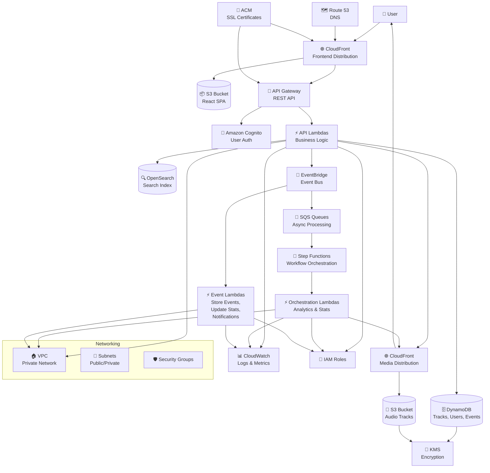

# AWS Infrastructure Diagram for Spotify Serverless App

```mermaid
graph TB
    %% Users and Frontend
    User[👤 User] --> CloudFront_Frontend[🌐 CloudFront<br/>Frontend Distribution]
    CloudFront_Frontend --> S3_Frontend[(📦 S3 Bucket<br/>React SPA)]

    %% API Layer
    CloudFront_Frontend --> API_Gateway[🚪 API Gateway<br/>REST API]
    API_Gateway --> Cognito[🔐 Amazon Cognito<br/>User Auth]
    API_Gateway --> Lambda_API[⚡ API Lambdas<br/>Business Logic]

    %% Data Storage
    Lambda_API --> DynamoDB[(🗄️ DynamoDB<br/>Tracks, Users, Events)]
    Lambda_API --> OpenSearch[(🔍 OpenSearch<br/>Search Index)]

    %% Event Processing
    Lambda_API --> EventBridge[📡 EventBridge<br/>Event Bus]
    EventBridge --> SQS[📨 SQS Queues<br/>Async Processing]
    SQS --> Step_Functions[🔄 Step Functions<br/>Workflow Orchestration]
    Step_Functions --> Lambda_Orchestration[⚡ Orchestration Lambdas<br/>Analytics & Stats]

    EventBridge --> Lambda_Events[⚡ Event Lambdas<br/>Store Events,<br/>Update Stats,<br/>Notifications]

    %% Media Streaming
    Lambda_API --> CloudFront_Media[🌐 CloudFront<br/>Media Distribution]
    Lambda_Orchestration --> CloudFront_Media
    CloudFront_Media --> S3_Media[(🎵 S3 Bucket<br/>Audio Tracks)]
    CloudFront_Media --> User

    %% Observability
    Lambda_API --> CloudWatch[📊 CloudWatch<br/>Logs & Metrics]
    Lambda_Orchestration --> CloudWatch
    Lambda_Events --> CloudWatch

    %% Security & Networking
    DynamoDB --> KMS[🔑 KMS<br/>Encryption]
    S3_Media --> KMS
    Lambda_API --> IAM[👮 IAM Roles]
    Lambda_Orchestration --> IAM
    Lambda_Events --> IAM

    subgraph "Networking"
        VPC[🏠 VPC<br/>Private Network]
        Subnets[📍 Subnets<br/>Public/Private]
        SG[🛡️ Security Groups]
    end

    Lambda_API --> VPC
    Lambda_Orchestration --> VPC
    Lambda_Events --> VPC

    %% Additional Services
    Route53[🗺️ Route 53<br/>DNS] --> CloudFront_Frontend
    ACM[📜 ACM<br/>SSL Certificates] --> CloudFront_Frontend
    ACM --> API_Gateway
```
<parameter name="filePath">/Users/ec2-user/spotify-app/infra_diagram.md