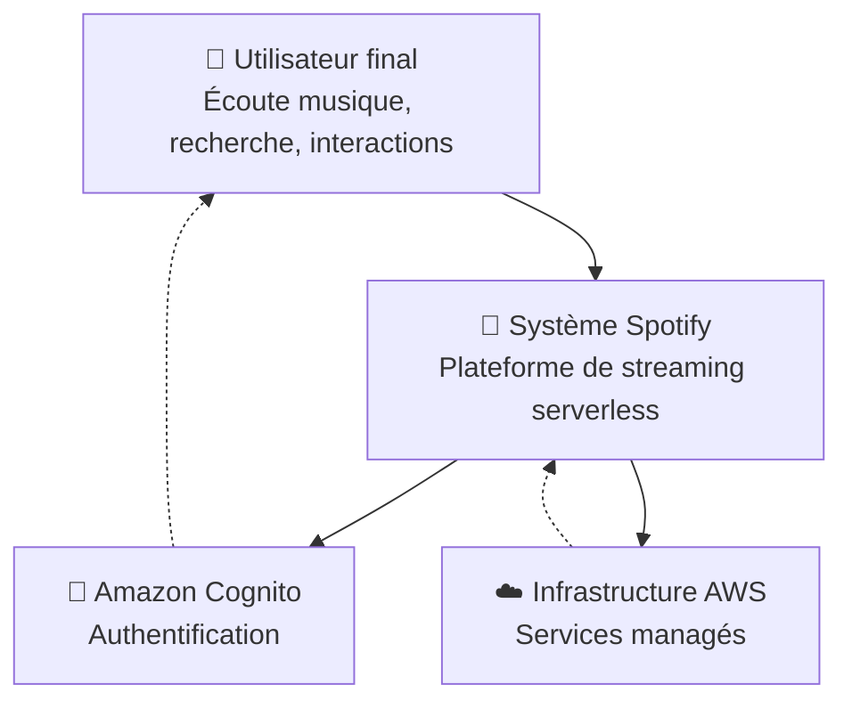
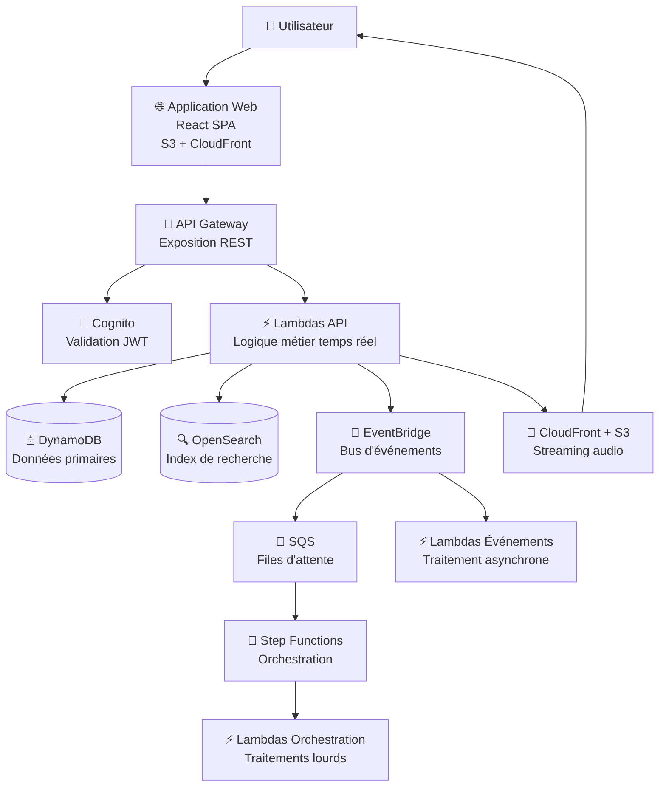
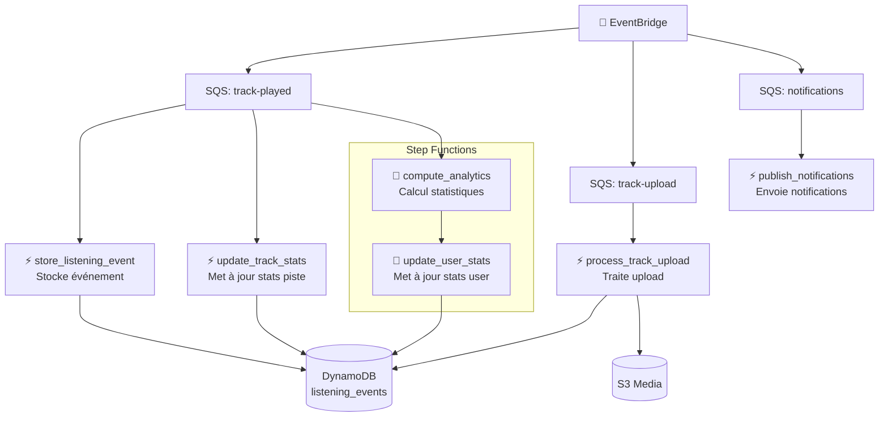

# Spotify Serverless App - Documentation Copilot

## Vue d'ensemble du projet

Ce projet implémente une **plateforme de streaming audio de type Spotify** conçue autour d'une architecture serverless, event-driven et scalable sur AWS. L'objectif est de créer un système distribué moderne capable de servir des millions d'écoutes, d'absorber des pics de charge et de séparer strictement le temps réel utilisateur des traitements lourds.

### Principes architecturaux fondamentaux

1. **Séparation stricte des plans** :
   - **Plan de contrôle** : API Gateway + Lambdas API pour la logique métier
   - **Plan de données** : CloudFront + S3 pour le streaming audio direct
   - **Plan événementiel** : EventBridge + SQS pour les traitements asynchrones

2. **Architecture serverless** : Pas de serveurs à gérer, scaling automatique

3. **Event-driven** : Tous les événements métier sont publiés et traités de manière asynchrone

4. **Sécurité first** : Chiffrement KMS, authentification Cognito, IAM least privilege

## Architecture C4

### 1. Contexte système (System Context)



**Explication** : Le système interagit avec l'utilisateur final pour le streaming audio et utilise Cognito pour l'authentification. Toute l'infrastructure repose sur les services AWS managés.

### 2. Conteneurs (Containers)



**Explication** :
- **Frontend** : Interface utilisateur en React, hébergée statiquement
- **API Gateway** : Point d'entrée REST avec authentification
- **Lambdas API** : Traitement synchrone des requêtes utilisateur
- **EventBridge/SQS** : Découplage pour les traitements asynchrones
- **Step Functions** : Orchestration des workflows complexes
- **DynamoDB/OpenSearch** : Stockage et recherche des métadonnées
- **S3/CloudFront Media** : Streaming direct des fichiers audio

### 3. Composants (Components) - Couche API

```mermaid
graph TB
    subgraph "API Gateway"
        Auth[Authentification<br/>Cognito JWT]
        Routing[Routing<br/>vers Lambdas]
    end

    subgraph "Lambdas API"
        GetMe[GET /me<br/>Profil utilisateur]
        GetTracks[GET /tracks<br/>Liste pistes]
        GetTrack[GET /track/{id}<br/>Détails piste]
        Search[POST /search<br/>Recherche]
        CreateTrack[POST /tracks<br/>Créer piste]
        PostListening[POST /listening<br/>Événement écoute]
        GetAnalytics[GET /analytics<br/>Statistiques]
    end

    Auth --> Routing
    Routing --> GetMe
    Routing --> GetTracks
    Routing --> GetTrack
    Routing --> Search
    Routing --> CreateTrack
    Routing --> PostListening
    Routing --> GetAnalytics

    GetMe --> DynamoDB[(DynamoDB)]
    GetTracks --> DynamoDB
    GetTrack --> DynamoDB
    Search --> OpenSearch[(OpenSearch)]
    CreateTrack --> DynamoDB
    PostListening --> EventBridge[📡 EventBridge]
    GetAnalytics --> DynamoDB
```

### 4. Composants (Components) - Couche Événements



## Flux fonctionnels détaillés

### 1. Authentification et autorisation
- Utilisateur se connecte via Cognito
- Reçoit un JWT token
- Toutes les requêtes API incluent le token dans l'Authorization header
- API Gateway valide le token avant de router vers les Lambdas

### 2. Streaming audio
- **Principe clé** : Aucun fichier audio ne transite par API Gateway ou Lambda
- Frontend demande l'URL signée via API
- API Lambda génère une URL pré-signée S3/CloudFront
- Frontend stream directement depuis CloudFront
- Avantages : Performance, coût, scalabilité

### 3. Gestion des métadonnées
- **DynamoDB single-table design** :
  - `PK` (Partition Key) : Identifiant principal
  - `SK` (Sort Key) : Identifiant secondaire
  - Tables : tracks, users, listening_events
- **OpenSearch** : Index full-text pour la recherche par titre, artiste, etc.

### 4. Événements et analytics
- Chaque action utilisateur génère un événement (play, pause, skip)
- Événements publiés sur EventBridge
- Routage vers SQS selon le type
- Traitement asynchrone :
  - Stockage immédiat des événements bruts
  - Mise à jour des statistiques en temps réel
  - Calculs analytiques différés via Step Functions

### 5. Upload de pistes
- Upload direct vers S3 via pré-signed URL
- Lambda traite les métadonnées (extraction ID3, génération waveform, etc.)
- Indexation dans OpenSearch
- Notification aux abonnés

## Infrastructure AWS détaillée

Voir le diagramme complet dans `infra_diagram.md`.

### Composants clés
- **Réseau** : VPC avec sous-réseaux public/privé, NAT Gateway
- **Sécurité** : Security Groups, IAM roles, KMS encryption
- **Monitoring** : CloudWatch logs, metrics, alarms, X-Ray tracing
- **CI/CD** : GitHub Actions pour déploiement automatisé

### Environnements
- **Dev** : Environnement de développement complet
- **Prod** : Environnement de production avec configurations optimisées

## Déploiement

### Prérequis
- AWS CLI configuré
- Terraform >= 1.4.0
- Node.js pour le frontend

### Déploiement infrastructure
```bash
cd infra/env/dev
terraform init
terraform plan
terraform apply
```

### Déploiement application
```bash
# Frontend
cd app/spotify_ui_frontend
npm install
npm run build
aws s3 sync dist/ s3://your-frontend-bucket

# Lambdas
cd app/lambdas
./build.sh
# Deploy via Terraform ou SAM
```

## Monitoring et observabilité

- **Logs** : CloudWatch Logs pour tous les Lambdas
- **Métriques** : Latence API, erreurs, utilisation ressources
- **Alertes** : Seuils configurés pour les erreurs critiques
- **Tracing** : X-Ray pour le suivi des requêtes distribuées

## Sécurité

- **Chiffrement** : Toutes les données sensibles chiffrées avec KMS
- **Authentification** : JWT via Cognito
- **Autorisation** : Vérification des permissions dans les Lambdas
- **Réseau** : Lambdas dans VPC privé, accès contrôlé via Security Groups

## Performance et scalabilité

- **Serverless scaling** : Lambdas scalent automatiquement
- **CDN** : CloudFront pour la distribution globale
- **Cache** : DynamoDB DAX, CloudFront caching
- **Optimisations** : Compression, minification, lazy loading

## Évolution et maintenance

- **Modularité** : Architecture en modules Terraform réutilisables
- **Tests** : Unit tests, integration tests, end-to-end tests
- **CI/CD** : Déploiements automatisés avec rollback
- **Documentation** : Mise à jour continue de cette doc

---

*Cette documentation est générée automatiquement par GitHub Copilot. Pour toute question ou modification, contactez l'équipe de développement.*